 

  <a href="https://github.com/mBlomsterberg/">
    <picture>
      <source srcset="logo_inv.png" media="(prefers-color-scheme: dark)">
      
    </picture>
  </a>

  <h3 align="center">Just a Readme</h3>

  

    Meet mBlomsterberg, a DevOps engineer with 2+ years of experience.
     
     
    <a href="https://blomsterberg.org">https://blomsterberg.org</a>
  

   

 
 

# License

Copyright (c) Mikkel Blomsterberg All rights reserved.

Licensed under the MIT license.

(<a href="#readme-top">back to top</a>)

